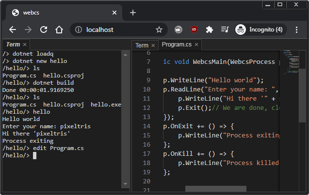

# webcs

Compile / run C# in a web browser (client side)

Try it here https://pixeltris.github.io/webcs

[Getting started](docs/GettingStarted.md) | [samples](/mono/managed/samples/) | [how it works](docs/HowItWorks.md) | [related projects](docs/Resources.md)

## Dependencies
- [Mono](https://github.com/dotnet/runtime/tree/main/src/mono/wasm) (.NET runtime) (MIT)
- [Roslyn](https://github.com/dotnet/roslyn) / [mcs](https://github.com/mono/mono/tree/main/mcs/mcs) (.NET compilers) (MIT)
- [Xterm.js](https://github.com/xtermjs/xterm.js) (terminals) (MIT)
- [PhosphorJS](https://github.com/phosphorjs/phosphor) (docking / menus) (BSD-3-Clause)
- [Monaco](https://github.com/microsoft/monaco-editor) (code editor) (MIT)
- [JSZip](https://github.com/Stuk/jszip) (zip / unzip / nuget) (MIT)
- [Font Awesome](https://github.com/FortAwesome/Font-Awesome) (font based icons) (SIL OFL 1.1, MIT, CC BY 3.0)