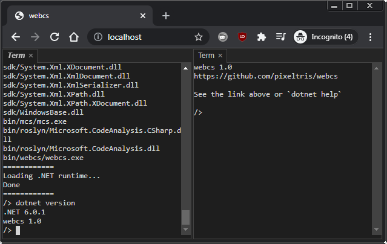

# About

This gives an overview of how webcs works.

## .NET runtime

The .NET runtime is [mono](https://github.com/dotnet/runtime/tree/main/src/mono/wasm) which is compiled to wasm using [Emscripten](https://github.com/emscripten-core/emscripten). For more info see [/mono/README.md](/mono/README.md).

Code execution occurs via the [interpreter](https://github.com/dotnet/runtime/blob/main/src/mono/mono/mini/interp/interp.c) (no JIT / AOT).

## UI loading / initialization process

The initial page contains a simple `
` with the text `Loading...`

The Emscripten callback `Module.onRuntimeInitialized` is assigned and when invoked it does the following:

- Loads [/mono/managed/files.json](/mono/managed/files.json) which contains a list of all known .NET assemblies. This used later to fetch files without requiring a dynamic web server.
- Mounts localStorage to `/loc/` and IndexedDB to `/idb/`. This targets the Emscripten filesystem (which is used by mono, and as such is visible to .NET code). Note: IndexedDB doesn't work in Firefox private browsing.
- Calls `initUI` which creates a [PhosphorJS](https://github.com/phosphorjs/phosphor) `DockPanel` instance, and creates two [Xterm.js](https://github.com/xtermjs/xterm.js) instances which get added to it.

Terminal commands can now be used. These are implemented by [xterm-commands.js](/ui/xterm-commands.js) and are hooked up by [xterm-controller.js](/ui/xterm-controller.js) (a fork of [local-echo](https://github.com/wavesoft/local-echo)). The controller handles various logic (input, history, tab completion, commands, escape sequence handlers, virtual processes, working directory).

The following is an example of using the `touch` command, followed by using tab completion after entering "fi":

`theme light` can be used to set the light UI theme. This uses basic css swapping and some minor additional logic for specific components (terminals / monaco). See `setTheme` in [ui.js](/ui/ui.js).

## .NET initialization

The command `dotnet load` will load the .NET runtime. Doing it manually (as opposed to when the page loads) means that the user can see what is being loaded and the intial page loads much faster.

- Call `TerminalCommand_dotnet.isDotNetLoaded` and check `WebcsInterop.allFilesByName` to see if all .NET assemblies are loaded (this array was previously filled by `files.json`).
- If .NET isn't fully loaded determine which files are missing, then call `WebcsInterop.loadFiles` which obtains them via `fetch`. Fetched assemblies then get loaded into mono via `mono_wasm_load_bytes_into_heap` / `mono_wasm_add_assembly`.
- Once all of the .NET assemblies are loaded call `WebcsInterop.initRuntime` which calls `mono_wasm_load_runtime`, `mono_wasm_runtime_ready`, and finally invoke `[webcs.exe] Webcs:Main` via `BINDING.call_static_method`.

## Creating projects (csproj), source files, and editing text

`edit hello.cs -t` creates a file called `hello.cs` and opens it with the text editor ([Monaco](https://github.com/microsoft/monaco-editor)).

`touch hello.cs` followed by `edit hello.cs` does the same (`-t` is a `touch`).

To explain how this works:

- `touch` will either call `FS.writeFile` or update `node.timestamp` depending on if the file already exists in the filesystem.
- `edit` calls `createContent` with a tab type of `TabType_TextEditor` which then calls `createTextEditor` which in turn creates an instance of Monaco with relevant data (source text / language info) and sets up a `Ctrl+S` input command handler for saving. Saving simply invokes `FS.writeFile` and removes the `*` text modified signifier from the tab title.

`dotnet new hello2` creates a folder named `hello2` and `hello2.csproj` / `Program.cs` with relevant contents.

## C# compilation

There are two included compilers: roslyn / mcs. The default compiler is roslyn. You can set the compiler to mcs via `dotnet setcomp mcs` and get the compiler info from `dotnet getcomp`.

`dotnet build` builds a csproj which is handled in `Webcs.Compile`

- Load and parse the csproj using `XmlDocument`. A very small subset of csproj tags are supported so it's worth looking at the code in `CompileInternal`.
- Default references are added. This includes `System.Private.CoreLib.dll` which has some negative side effects. You generally wont want to use compiled assemblies outside of webcs. Changing the compiler code to use reference assemblies should fix this but would double download size (TODO: Introduce reference assemblies as an optional feature / load them on request).
- Once the compiler input parameters have been collected they are then passed to the abstract function `WebcsCompiler.Compile` handled in `WebcsCompilerRoslyn` / `WebcsCompilerMcs`. The code path then follows a standard compilation for the given compiler. mcs has some minor binary tweaks which are documented in the code.

*You may notice compilation is done via reflection, there isn't a good reason. But it does mean that `webcs.exe` isn't dependant on roslyn / mcs.*

`dotnet csc Program.cs /r:webcs.exe` is another way to compile. The code path is identical but in this case the command line args are parsed instead.

## Running assemblies

`hello2.exe` runs `dotnet hello.exe` which calls `Webcs.RunMain` and does the following:

- Ensure the assembly file exists.
- Call `Assembly.Load(byte[])`. This is opposed to `LoadFile` / `LoadFrom` as they wont pick up the new assembly when recompiled. Note that `Load` will leak memory on each run (assemblies can't be unloaded).
- Using reflection locate the entry point `Main` and then use that location to find a static method `WebcsMain` which takes an arg of `WebcsProcess`.
- Create a `WebcsProcess` instance, fill it with the relevant info (args, working directory, process id), and then invoke `WebcsMain`.
- The process will not "exit" until `WebcsProcess.Exit` is called. If this is never called then Ctrl+C (^C) will need to be used to kill the process.

`hello2.exe --main` can be used to force run `Main` instead of `WebcsMain`. Console output is redirected from the browser console log to the terminal. If you'd prefer the console log you can use `--mainc` instead.

In both cases (`--main` / `--mainc`) the virtual process "stops" as soon as the `Main` function returns as there isn't a `WebcsProcess` context.

Async in `WebcsMain` should be treated with care as code will continue running in the background unless you explicitly stop it (we don't have real processes, and web workers (which can be killed) aren't being used here). Generally avoid async in `Main`.

## github / nuget

`github` and `nuget` commands provide readonly access to github repos and nuget packages via their REST APIs. Both support unauthenticated requests (with rate limits) which is ideal. The implementations are fairly straight forward. See `TerminalCommand_github` / `TerminalCommand_nuget`

Note:

- `nuget` needs a lot of improvement (you currently need to `mv` the assembly you want).
- Basically nothing fetched via `github` will compile.

## Self hosting

Any static web server can be used.

As mentioned above the client knows about all .NET assemblies from `files.json` and as such everything can be delievered via a static web server. The client does all the work.

For updating dependancies see [index.html](/index.html) and [/mono/README.md](/mono/README.md).

## Limitations and future work

[LimitationsAndFutureWork.md](LimitationsAndFutureWork.md)