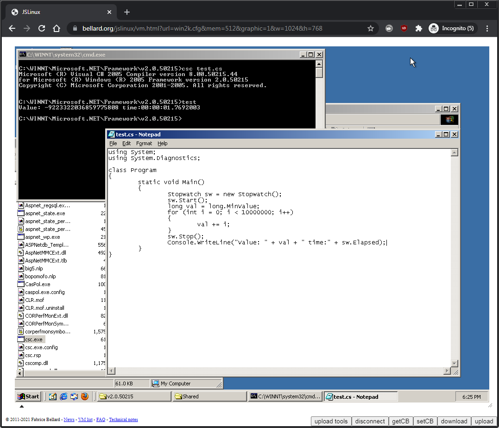

# Limitations and future work

There are a number of limitations with the way this project was designed (and the web in general).

## No blocking operations and features flagged as `UnsupportedOSPlatform`

JavaScript / WebAssembly cannot do blocking operations on the [main thread](https://developer.mozilla.org/docs/Glossary/Main_thread). Additionally there are limitations in the standard libraries such as:

- [Monitor.Wait](https://github.com/dotnet/runtime/blob/84680bf557210114ea5ca823386cd49691c4cac6/src/libraries/System.Private.CoreLib/src/System/Threading/Monitor.cs) which Task depends on for synchronous waits. Roslyn uses this for code paths which produce debug files (even on synchronous compilation).
- [Console.ReadLine](https://github.com/dotnet/runtime/blob/84680bf557210114ea5ca823386cd49691c4cac6/src/libraries/System.Console/src/System/Console.cs#L716-L722) isn't supported due to there being no in-built terminal (and this is a blocking operation).
- [Thread.Start](https://github.com/dotnet/runtime/blob/84680bf557210114ea5ca823386cd49691c4cac6/src/mono/System.Private.CoreLib/src/System/Threading/Thread.Browser.Mono.cs) which limits use of threaded code.
- [Crypto APIs aren't supported](https://github.com/dotnet/runtime/issues/40074). There is [work being done on this](https://github.com/dotnet/designs/blob/0486d48fd9ca05496325d0283c0d520ebcabb401/accepted/2021/blazor-wasm-crypto.md), but it's not a full implementation. For example MD5 isn't being implemented and `mcs code.cs -debug` depends on it and therefore can't produce PDBs (though mcs could be tweaked to fix this).
- [Various bits of code](https://github.com/dotnet/runtime/search?q=UnsupportedOSPlatform+browser&type=code) and some [assemblies](https://github.com/dotnet/runtime/search?p=1&q=UnsupportedOSPlatforms+browser&type=code) including `FileSystemWatcher` (though not a problem for webcs itself per-se).

## Assembly loading / unloading

Another big problem is that assemblies get loaded once and never get unloaded. Every time `dotnet [BINARY]` is run it loads the assembly again via `Assembly.Load(byte[])` which leaks memory. This is required to ensure recompiled binaries are reloaded and also so that static variables are reset.

## System.Console.dll

A partial implementation is provided which directs output to `console.log` / `console.warn`. Most of the other functions / properties are flagged `UnsupportedOSPlatform`. A complete reimplementation for webcs would be ideal. However, there is a deeper issue; as `Console.ReadLine` and `Console.WriteLine` are static functions with no context of what called those functions it makes it impossible to know which terminal should be handling the input/output.

For `dotnet [BINARY] --main` console output is temporarily redirected to the calling terminal. This doesn't work for code which uses `Console.WriteLine` on an async callback so it's quite limited (and `Console.ReadLine` isn't supported).

## Solution #1 - Web workers

Web workers could be used to solve the above issues. Each run of a binary would spin up a web worker and initialize its own instance of the .NET runtime. This would isolate everything so there's context info for a custom implementation of `System.Console.dll` and assembly loading shouldn't leak memory (as memory should get reclaimed when the web worker terminates).

Implementing this would require a redesign of webcs. A communication channel would needed to interact with Xterm.js and a new file system would be needed to sync everything up between all of the web workers (see [emception SHAREDFS.js](https://github.com/jprendes/emception#sharedfsjs)).

One drawback of this solution is that it might make it harder to follow the code execution flow of webcs which is currently fairly straight forward. Also the upfront memory costs would be higher (as each web worker would need its own .NET runtime instance).

## Solution #2 - Green threads

[Green threads](https://wikipedia.org/wiki/Green_threads). This was mentioned as a [possibility for implementation of the crypto APIs](https://github.com/dotnet/designs/blob/0486d48fd9ca05496325d0283c0d520ebcabb401/accepted/2021/blazor-wasm-crypto.md#ongoing-investigations) but wasn't chosen due to complexity / wider impact requirements on the .NET runtime just to get crypto APIs working.

As this would require working knowledge of the mono runtime and most likely non-trivial changes it's unlikely this project will take on this task. But it could be a good solution to providing threading and allowing blocking calls. However, the issue of memory being leaked from `Assembly.Load(byte[])` would persist.

## Solution #3 - Stack frame snapshots for blocking operations

Similar to green threads you could save / restore stack frames for blocking operations. This should be a lot easier to implement than a virtual threading solution. The interpreter [already supports frame snapshots](https://github.com/dotnet/runtime/blob/1c927462696f5af7d5e667f54b1c39452cba4b2d/src/mono/mono/mini/interp/interp.c#L3787-L3791) as way of avoiding recursive calls. This could allow for natural usage of `System.Console.dll` (a new implementation) with a smaller number of changes to the .NET runtime.

## Solution #4 - System emulator (x86, ARM, MIPS, other)

A full system emulator which targets the web could be used to run an unmodified .NET runtime. [Buildroot](https://wikipedia.org/wiki/Buildroot) could be used to make a tiny build of linux to reduce transfer size. This would solve all of the above issues and should have perfect compatibility.

This would probably be better off as a seperate project but I think it would be a relatively small amount of work to get this hooked up to the same UI as webcs.

The biggest issue with this solution is likely to be performance. It probably wouldn't run as fast as the mono interpreter unless an x86->WASM JIT is incorporated. Another issue is the time taken to initialize Linux. Snapshots might be one option for near instant OS load time (but would greatly increase download size).

See [JSLinux](https://bellard.org/jslinux), [v86](https://github.com/copy/v86), [halfix](https://github.com/nepx/halfix), [Boxedwine](https://github.com/danoon2/Boxedwine), and [others](https://github.com/fcambus/jsemu). Also see [cheerpx](https://leaningtech.com/cheerpx) for a binary level x86 interpreter and x86->WASM JIT capable of running unmodified Linux binaries.

Below is an example of running .NET Framework 2.0 under [JSLinux](https://bellard.org/jslinux) transferred in using [ww32vmt](https://github.com/pixeltris/ww32vmt). The same code runs 8x faster on the .NET wasm runtime (6.0.1) when testing on webcs.

## Plans (lack thereof...)

There currently aren't any plans to implement any of the above solutions. But web workers would be the most sensible choice as it would help with most of the issues without having to modify the .NET runtime.

As mentioned elsewhere the `nuget` command could do with improvements and compilation could do with various improvements (workspaces / msbuild, use reference assemblies, nugets). Again, there currently aren't any plans to work on this. The compiler improvements would significantly increase download size which is already fairly large for a website and increasing this reduces the motivating factors. Perhaps if these were made as optional features it might be more appealing.

See [TODO.md](TODO.md) for other things which probably wont be worked on.